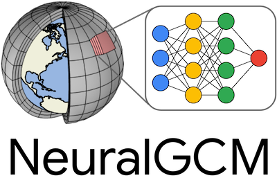

# Neural General Circulation Models for Weather and Climate

NeuralGCM is a Python library for building hybrid ML/physics atmospheric models
for weather and climate simulation.

- **[Paper](https://arxiv.org/abs/2311.07222)**
- **[Documentation](https://neuralgcm.readthedocs.io/)**
- **License**:
    - Code: [Apache License, Version 2.0](https://www.apache.org/licenses/LICENSE-2.0)
    - Trained model weights: [Creative Commons Attribution-ShareAlike 4.0 International](https://creativecommons.org/licenses/by-sa/4.0/).

To stay up to date on NeuralGCM, **[subscribe to our mailing list](https://groups.google.com/g/neuralgcm-announce)**!
